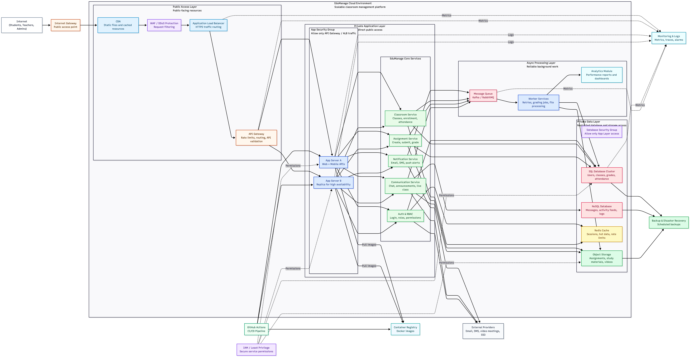

# EduManage Classroom Management Platform

## GitHub Repository

Repository link:

```text
https://github.com/RohanVashisht1234/college-system-design
```
[Click to open GitHub Repository.](https://github.com/RohanVashisht1234/college-system-design)

Google Colab link:

```text
https://colab.research.google.com/drive/1BXZRrdZ3ZTJDe93QXP8ldVA0SFM0LkgC?usp=sharing
```

[Click to open Colab](https://colab.research.google.com/drive/1BXZRrdZ3ZTJDe93QXP8ldVA0SFM0LkgC?usp=sharing)





EduManage is a demonstration project for a scalable classroom management platform. It models how students, teachers, and administrators interact with digital classrooms, assignments, attendance, grading, communication, learning resources, and analytics.

This project is created for a system design case study. The Python notebooks are runnable demonstrations, not production backend code.

## Project Overview

The project contains:

- A System architecture diagram for EduManage.
- A Python notebook that shows how data moves between system components using functions and if-else routing logic.

The goal is to explain how a cloud-based educational platform can support thousands of institutions and millions of users while maintaining scalability, reliability, secure access control, and efficient academic operations.

## Files Included

```text
.
├── Documentation.pdf
├── README.md
├── edumanage_component_flow.ipynb
└── system_diagram.png
```

## System Architecture

The architecture diagram is available in:

```text
system_diagram.png
```

It includes the following major components:

- Internet users: students, teachers, and administrators
- CDN, WAF, load balancer, and API gateway
- Authentication and role-based access control
- Classroom, assignment, grading, communication, notification, and resource services
- SQL database, NoSQL database, Redis cache, and object storage
- Message queue and worker services
- Analytics, monitoring, logs, backups, IAM, and external providers

## Dependencies

The notebooks use only Python standard-library modules.

Required:

- Python 3.10 or later
- Jupyter Notebook or JupyterLab, if you want to open and run `.ipynb` files interactively

Python modules used:

- `dataclasses`
- `datetime`
- `enum`
- `statistics`
- `typing`
- `uuid`

No external Python package is required for the demo logic.

## Setup Instructions

1. Clone or download this project.

```bash
git clone https://github.com/RohanVashisht1234/college-system-design.git
cd college-system-design
```

2. Optional: create a virtual environment.

```bash
python3 -m venv .venv
source .venv/bin/activate
```

3. Optional: install Jupyter if it is not already installed.

```bash
pip install notebook
```

## Execution Steps

### Run the Main Flow Notebook

Open:

```text
edumanage_component_flow.ipynb
```

Run all cells from top to bottom.

This notebook demonstrates:

- Each architecture component as a Python function
- Request routing through components
- If-else decisions for routing
- Authentication and RBAC checks
- Assignment submission flow
- Grading flow
- Message queue and worker processing
- Analytics report generation

## Additional Project Details

### Functional Requirements Covered

- Teachers can create classrooms.
- Teachers can enroll students.
- Teachers can publish assignments.
- Students can submit assignments.
- Teachers can grade submissions and provide feedback.
- Teachers can post announcements.
- Attendance can be marked for students.
- Students and teachers receive notifications.
- Administrators can view reports.

### Non-Functional Requirements Covered

- Scalability through load balancing, service separation, caching, and async queues.
- Reliability through backups, worker retries, and monitoring.
- Security through authentication, RBAC, WAF, IAM, and private data layers.
- Performance through CDN caching, Redis caching, and separated storage systems.
- Fault tolerance through replica app servers, queues, backups, and disaster recovery planning.

### Database Design Summary

- SQL database: users, classrooms, enrollments, assignments, submissions, grades, and attendance.
- NoSQL database: communication logs, activity feeds, and flexible message records.
- Object storage: assignment files, study materials, videos, and backups.
- Redis cache: sessions, hot metadata, and rate-limit counters.
- Analytics warehouse or module: reports, performance trends, and academic dashboards.

### Technology Stack

Suggested real-world stack:

- Frontend: React, Next.js, Flutter, or native mobile apps
- Backend: Python FastAPI or Django
- API gateway: AWS API Gateway, Kong, or NGINX
- Database: PostgreSQL or MySQL
- NoSQL: MongoDB, Cassandra, or DynamoDB
- Cache: Redis
- Queue: Kafka or RabbitMQ
- File storage: Amazon S3, Azure Blob Storage, or Google Cloud Storage
- Monitoring: CloudWatch, Prometheus, Grafana, or OpenTelemetry
- CI/CD: GitHub Actions
